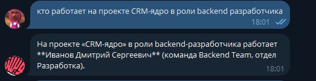
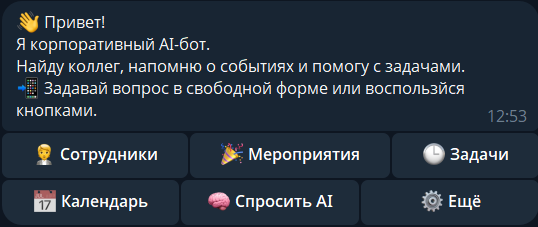
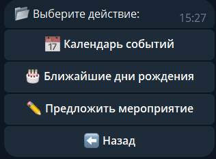
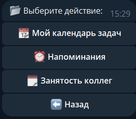
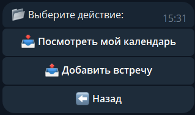
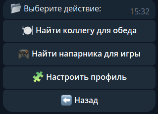

# 🧠 CorpMind — корпоративный AI-бот


🧠 CorpMind — умный Telegram-бот, который помогает сотрудникам ориентироваться внутри компании, искать нужную информацию и быть в курсе событий. Просто спроси как хочешь, получи что нужно.

---

## ✨ Что умеет CorpMind:
🔍 Поиск сотрудников по имени, отделу, проекту  

🎉 HR-активности и события: дни рождения, митапы, welcome-дни  

🧠 AI-поиск по задачам, мероприятиям и коллегам  

⏰ Личный календарь и напоминания  

🔗 Интеграция с корпоративными системами  

💬 Понимает свободную речь и отвечает естественно

---
## 📇 Структура данных сотрудников

Каждый сотрудник в CRM представлен следующим набором полей:

| Поле                  | Описание                                                                 |
|-----------------------|--------------------------------------------------------------------------|
| **ФИО**               | Полное имя сотрудника. Используется для основного поиска по имени.      |
| **Telegram ID**       | Уникальный Telegram-идентификатор для взаимодействия через бота.         |
| **День рождения**     | Используется для уведомлений о предстоящих днях рождения.                |
| **Отдел**             | Название отдела (например: "Аналитика", "Разработка"). По нему ищут коллег. |
| **Стек**              | Основной технологический стек. Помогает находить экспертов по технологиям. |
| **Команда**           | Локальная команда внутри отдела (например: "BI Team", "Backend A").      |
| **Уровень**           | Грейд сотрудника: джуниор, мидл, сеньор и т.д.                           |
| **Комментарий**       | Дополнительное описание роли сотрудника в команде.                       |
| **Проекты**           | Список проектов, в которых участвует сотрудник. Используется при поиске по проекту. |
| **Навыки**            | Перечень ключевых навыков. Используется при подборе специалистов.        |
| **Ближайшее мероприятие** | Название и дата ближайшего события с участием сотрудника.             |
| **Напоминание**       | Включено/выключено — указывает, активны ли персональные напоминания.     |
| **Занятость сейчас**  | Текущая активность (отображается при запросе доступности).               |
| **Календарь задач**   | Список ближайших задач с датами. Используется для анализа загруженности. |

---

## 🔎 Как работает поиск сотрудников

Бот поддерживает следующие режимы поиска:

| Тип поиска            | Описание                                                                 |
|------------------------|--------------------------------------------------------------------------|
| **По имени**           | Поиск по полному или частичному совпадению ФИО.                          |
| **По отделу**          | Выдаёт список сотрудников конкретного отдела.                            |
| **По проекту**         | Показывает всех, кто задействован в заданном проекте.                    |
| **По навыку или стеку**| Ищет сотрудников с нужным технологическим стеком или навыком.            |
| **По занятости**       | Определяет, кто из коллег сейчас свободен или чем занят.                 |
| **По дням рождения**   | Отображает сотрудников, у кого скоро день рождения.                      |
| **По участию в мероприятии** | Показывает участников конкретного мероприятия.                  |

Примеры запросов:  

  


---

## 🧾 Главное меню бота

Главное меню содержит шесть основных кнопок:  

  

| Кнопка           | Назначение                                               |
| ---------------- | -------------------------------------------------------- |
| 🧑‍💼 Сотрудники | Поиск сотрудников по имени, отделу, проекту              |
| 🎉 Мероприятия   | Календарь событий, дни рождения, предложение мероприятия |
| 🕒 Задачи        | Личный календарь, напоминания, занятость коллег          |
| 📅 Календарь     | Просмотр календаря, добавление встреч                    |
| 🧠 Спросить AI   | Интеллектуальные ответы от GigaChat                      |
| ⚙️ Ещё           | Поиск коллег для обеда, игр и настройки профиля          |

### Вложенные меню

#### 📁 Сотрудники:
  

| Кнопка              | Назначение                           |
| ------------------- | ------------------------------------ |
| 🔍 Поиск по имени   | Найти коллегу по имени               |
| 🏢 Поиск по отделу  | Найти сотрудников конкретного отдела |
| 📁 Поиск по проекту | Найти участников нужного проекта     |

#### 🎉 Мероприятия:
  

| Кнопка                    | Назначение                            |
| ------------------------- | ------------------------------------- |
| 📅 Календарь событий      | Просмотр предстоящих мероприятий      |
| 🎂 Ближайшие дни рождения | Список ближайших дней рождения коллег |
| ✏️ Предложить мероприятие | Отправить предложение нового события  |

#### 🕒 Задачи:


| Кнопка                 | Назначение                           |
| ---------------------- | ------------------------------------ |
| 📆 Мой календарь задач | Просмотр личных задач и дедлайнов    |
| ⏰ Напоминания          | Создание и управление напоминаниями  |
| 🗓️ Занятость коллег   | Узнать доступность коллег по времени |

#### 📅 Календарь:
  

| Кнопка                      | Назначение                         |
| --------------------------- | ---------------------------------- |
| 📥 Посмотреть мой календарь | Вывод личного календаря на экран   |
| 📤 Добавить встречу         | Добавить новое событие в календарь |


#### ⚙️ Ещё:
  

| Кнопка                      | Назначение                                           |
| --------------------------- | ---------------------------------------------------- |
| 🍽️ Найти коллегу для обеда | Поиск свободных коллег для совместного обеда         |
| 🎮 Найти напарника для игры | Поиск коллег для совместного отдыха или игры         |
| 🧩 Настроить профиль        | Изменение личных данных: имя, должность, отдел и пр. |

---

## 📁 Структура проекта

```
.
├── main.py           # Точка входа в приложение
├── data_base.py      # Работа с базой данных сотрудников, мероприятий и задач
├── handlers.py       # Обработка сообщений, команд и взаимодействие с AI
├── keyboards.py      # Создание клавиатур и подменю бота
├── requirements.txt  # Зависимости проекта
└── README.md         # Документация проекта
```

---

## 🔧 Установка и запуск

1. **Клонируйте репозиторий:**

```bash
git clone https://github.com/yourusername/yourproject.git
cd yourproject
```

2. **Создайте и активируйте виртуальное окружение:**

#### Windows:

```bash
python -m venv venv
venv\Scripts\activate
```

#### macOS / Linux:

```bash
python3 -m venv venv
source venv/bin/activate
```

3. **Установите зависимости:**

```bash
pip install aiogram gigachat
```

4. **Запустите бота:**

```bash
python main.py
```

---

## 🧠 Как это работает

Бот реализован с использованием Python, библиотеки [Aiogram](https://docs.aiogram.dev/) и GigaChat API для интеллектуального взаимодействия.
* `main.py` — стартовая точка бота, подключение маршрутов и конфигураций
* `handlers.py` — логика обработки сообщений, AI-запросов и inline-кнопок
* `keyboards.py` — структура и логика inline-клавиатур
* `data_base.py` — внутренняя база данных сотрудников, задач, событий
* `GigaChat API` — отвечает на свободные запросы, извлекая данные из внутренней базы

---

## 👥 Авторы проекта

* **Максим Иванов** — backend, frontend  

  Telegram: [@aaaaa23030](https://t.me/aaaaa23030)

* **Марина Чернышева** — management, pitching  

  Telegram: [@yksus\_147](https://t.me/yksus_147)

---